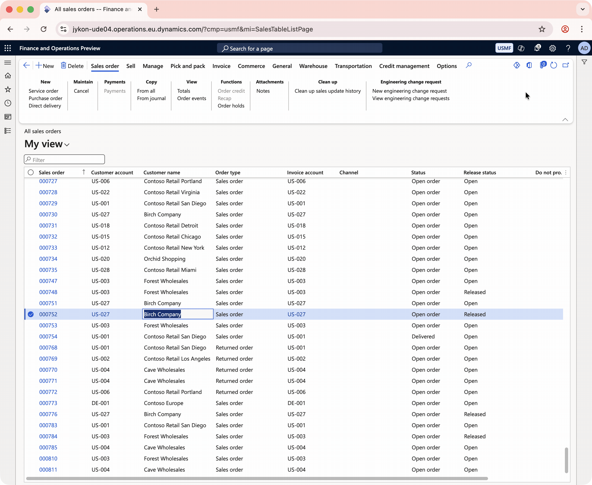

# D365 Copilot Toolbox

A community-driven framework for enabling **multi-agent workflows** in **Dynamics 365 Finance & Operations**. This repository provides solutions, examples, and integrations that bring AI agents into D365 F&O to enhance business processes and user productivity.

[](../../actions/workflows/build.yml)


> **By the community, for the community!**
>
> Inspired by the [D365FOAdminToolkit](https://github.com/ameyer505/D365FOAdminToolkit) project.
> Initial idea by Lone Gru (lone.gru@arineo.com)

---



## Overview

The D365 Copilot Toolbox is designed to enable **multi-agent workflows** within D365 Finance & Operations. The project includes multiple solutions and examples that demonstrate how to integrate AI agents into ERP business processes.

### Core Solution: Copilot Studio Agent Integration

The primary solution provides a ready-to-use, performant and light-weight extensible control (`COTXCopilotHostControl`) that embeds Microsoft Copilot Studio agents directly inside any D365 F&O form — either as a **global side panel** or as a **local tab embedded on a specific form**. The control handles:

- **MSAL.js browser-side authentication** — runs the agents in the context of users, with the security model from Copilot Studio (MSAL v5 with locally bundled libraries)
- **Copilot Studio Agent SDK** — modern M365 Agent SDK implementation (`@microsoft/agents-copilotstudio-client`), that allows for seamless integration to Copilot Studio
- **Multiple conversation tabs** — open up to 8 parallel chat sessions per control, with add, close, rename, and restart support
- **Automatic ERP context injection** — legal entity, current form, record, navigation info sent as channel data
- **Tool call visualization** — optional Adaptive Card display of agent tool execution, and reasoning/thought
- **Event-driven responses** — X++ delegates let form code react to agent replies - Usage as the control as a Copilot proxy
- **Application Area Routing** — Configure separate agents per business area (Sales, Inventory, Finance, etc.)
- **Extensible Architecture** — Add new agents and application areas without modifying core code
- **Supply-chain safe** — all vendor JavaScript libraries are bundled locally as AxResources, not loaded from external CDNs at runtime

## Current Solutions

This repository currently includes:

1. **Copilot Studio Agent Integration** — The core framework for embedding Microsoft Copilot Studio agents into D365 F&O forms (detailed above)
2. **SalesTable Example** — Reference implementation showing agent integration on the Sales Order form

### Future Solutions & Examples

The project is designed to grow with contributions from the community. Future solutions may include:
- Agent orchestration patterns for complex workflows
- Pre-built agents for common ERP tasks
- Integration with other AI services and platforms
- Industry-specific agent templates

## Quick Start

See the [Getting Started Guide](docs/getting-started.md) for prerequisites, installation, and initial configuration.

## Documentation

| Document | Description |
|----------|-------------|
| [Getting Started](docs/getting-started.md) | Prerequisites, installation, and first-time setup |
| [Architecture](docs/architecture.md) | Technical design, control lifecycle, and data flow |
| [Configuration](docs/configuration.md) | Agent parameter setup, Entra ID, Copilot Studio connection |
| [Extending](docs/extending.md) | Adding agents to custom forms, new application areas, handling responses |
| [Security](docs/security.md) | Roles, duties, privileges, and Entra ID app registration |
| [Contributing](CONTRIBUTING.md) | How to contribute, coding standards, and PR guidelines |
| [Changelog](CHANGELOG.md) | Version history and release notes |

## Project Structure

```
D365CopilotToolbox/
├── Metadata/
│   ├── CopilotToolbox/              # Main model (module: CopilotToolbox)
│   └── CopilotToolboxExamples/      # Example model (module: CopilotToolboxExamples)
├── Project/
│   ├── CopilotAgentHost/            # VS project for main model
│   └── CopilotHostExamples/         # VS project for examples model
├── Scripts/
│   ├── RegisterSymbolicLinks.ps1    # Create symlinks for local development
│   ├── UnregisterSymbolicLinks.ps1  # Remove symlinks
│   ├── Update-VendorLibs.ps1        # Download/update vendor JS libraries
│   └── vendor-libs.json             # Vendor library manifest (packages, versions)
├── Templates/                       # (Reserved for future templates)
├── .github/                         # CI/CD workflows (build + vendor lib updates)
└── .FSC-PS/                         # FSC-PS configuration
```

## Models

The repository is organized into models that contain different solutions and examples:

| Model | Module | Description | Dependencies |
|-------|--------|-------------|--------------|
| **Copilot Toolbox** | `CopilotToolbox` | Core framework for Copilot Studio agent integration — control, tables, security, resources | ApplicationFoundation, ApplicationPlatform, ApplicationSuite |
| **Copilot Toolbox Examples** | `CopilotToolboxExamples` | Example implementations and reference patterns (currently includes SalesTable integration) | ApplicationPlatform, ApplicationSuite, CopilotToolbox |

Additional models for future solutions will be added as the project grows.

## Contact & Contribution

Want to contribute? We'd **LOVE** to have you! See the [Contributing Guide](CONTRIBUTING.md) for details.

There are several ways to contribute:
- Add new features
- Report bugs
- Request new features
- Documentation

Feel free to reach out to **copilot@erpilots.com** for any questions or feature suggestions.

## Legal

This project is licensed under the [MIT License](LICENSE).

All features are provided **as-is**, without support or warranty of any kind.

## Build

The GitHub build action is based on [FSC-PS for GitHub](https://github.com/fscpscollaborative/fscps).

**Target version:** 10.0.45 GA
