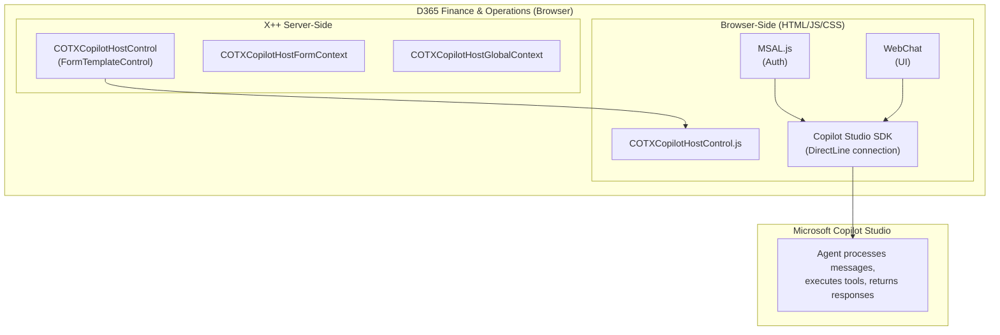
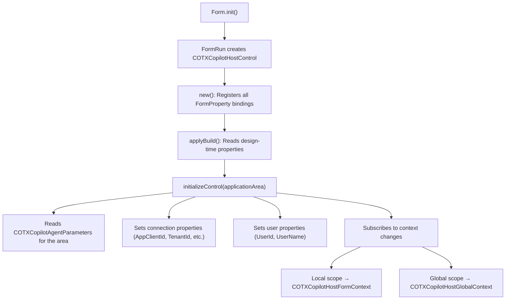
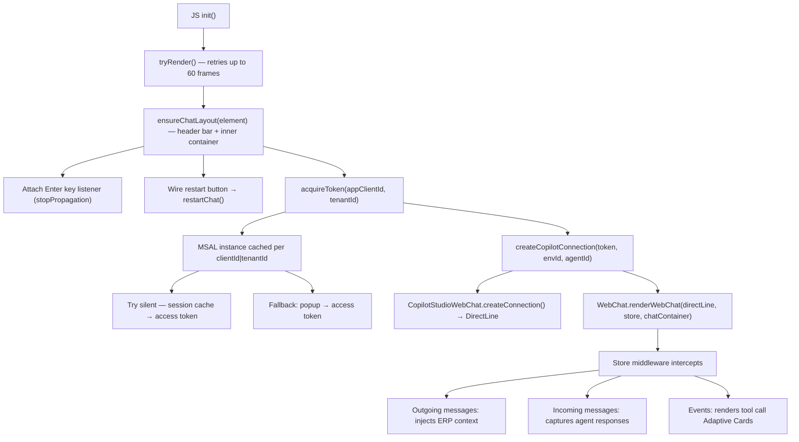
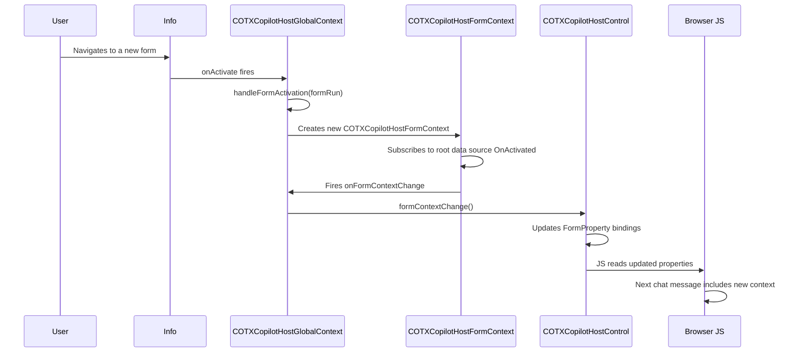
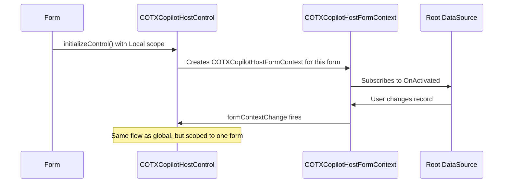
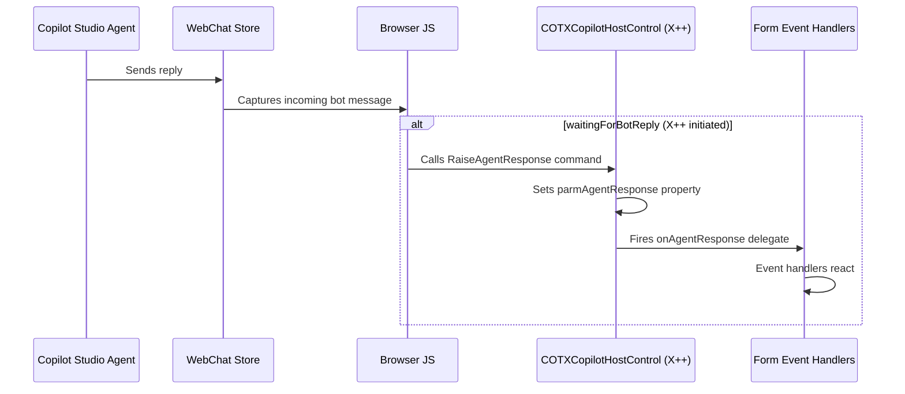

# Architecture

This document describes the technical architecture of the D365 Copilot Toolbox core solution for integrating Microsoft Copilot Studio agents into D365 Finance & Operations.

The Copilot Toolbox is designed to enable **multi-agent workflows** in D365 F&O. This architecture focuses on the foundational Copilot Studio integration, which provides the framework for embedding agents, routing to different agents based on application areas, and managing context flow between D365 and AI agents.

## High-Level Architecture



## Component Overview

### X++ Server-Side Components

| Class | Responsibility |
|-------|---------------|
| `COTXCopilotHostControl` | Main extensible form control. Reads agent configuration from the database, initializes form properties, and passes them to the browser-side JS. Handles incoming agent responses via `RaiseAgentResponse` command. |
| `COTXCopilotHostControlBuild` | Design-time companion class. Exposes `Application Area` and `Context Scope` properties in the Visual Studio form designer. |
| `COTXCopilotHostFormContext` | Tracks a single form's context: data area, form caption, menu item name, root data source table/record, and natural key/value. Fires `onFormContextChange` when the active record changes. |
| `COTXCopilotHostGlobalContext` | Singleton that subscribes to `Info.onActivate`; when the user navigates between root-navigable forms, it constructs a new `COTXCopilotHostFormContext` and propagates changes to the side panel control. |

### Browser-Side Components

| File | Responsibility |
|------|---------------|
| `COTXCopilotHostControl.html` | Loads MSAL.js 4.13.1, WebChat 4.18.0, and the main JS file. Contains the root `<div>` for the control. |
| `COTXCopilotHostControl.js` | Orchestrates the entire browser-side flow: MSAL token acquisition (with per-client instance caching), Copilot Studio SDK connection, chat layout creation (header bar + inner container), WebChat rendering, chat restart lifecycle, context injection middleware, tool call card rendering, and D365 extensible control registration. |
| `COTXCopilotHostControl.css` | Styles the chat interface — header bar with restart button, chat container layout, bubble appearance, tables, lists, scrollbars, and headings — to match a modern Copilot aesthetic. |

### Data Model

| Table | Purpose |
|-------|---------|
| `COTXCopilotAgentParameters` | Stores per-agent configuration: Entra ID credentials, Dataverse connection details, context and display preferences. Cross-company (shared). |
| `COTXCopilotAgentApplicationAreas` | Maps `COTXCopilotAgentApplicationArea` enum values to `COTXCopilotAgentParameters` records. Enables multi-agent routing by application area. |

## Control Lifecycle

### 1. Form Initialization



### 2. Browser-Side Rendering



### 3. Context Flow

#### Global Context (Side Panel)



#### Local Context (Embedded Control)



### 4. Agent Response Handling



## Context Data Structure

The ERP context is injected into the `channelData.context` of every outgoing WebChat message:

```json
{
  "channelData": {
    "context": {
      "userLanguage": "en-us",
      "userTimeZone": "GMT Standard Time",
      "callingMethod": "",
      "legalEntity": "USMF",
      "currentUser": "Admin",
      "currentForm": "All Sales Orders",
      "currentMenuItem": "Sales order",
      "formMode": "",
      "currentRecord": {
        "tableName": "Sales order",
        "naturalKey": "Sales order",
        "naturalValue": "SO-000123"
      }
    }
  }
}
```

## Design Decisions

| Decision | Rationale |
|----------|-----------|
| **Browser-side MSAL** | No server-side secrets needed; leverages the user's existing Entra ID session. Popup fallback ensures first-time auth works. |
| **FormTemplateControl** | D365's extensible control pattern provides property binding, build-time designer support, and lifecycle hooks. |
| **Global singleton for context** | A single `COTXCopilotHostGlobalContext` instance subscribes once to `Info.onActivate`, avoiding redundant subscriptions. |
| **Application area routing** | Lookup table pattern allows multiple agents, with `Fallback` as a catch-all, extensible via enum extensions. |
| **Custom form pattern for side panel** | Aside pane forms require the `Custom` pattern and `setDisplayTarget(AsidePane)` before `super()` — this is per Microsoft guidance. |
| **Keep connection alive option** | When enabled, `dispose()` skips terminating the Direct Line connection. This avoids the latency of re-authenticating and reconnecting when the form is re-opened quickly. The flag is read once after full initialization — it is not re-evaluated at dispose time. |
| **MSAL instance caching** | A module-scoped `_msalCache` object stores `PublicClientApplication` instances keyed by `clientId|tenantId`. This prevents creating duplicate MSAL instances across chat restarts or multiple control instances on the same page, reducing memory overhead and avoiding redundant `initialize()` calls. |

## External Dependencies

> **Vendor libraries are bundled locally** as AxResources.
> They are **not** loaded from external CDNs at runtime. Use `Scripts/Update-VendorLibs.ps1`
> to download or update them. See `Scripts/vendor-libs.json` for the manifest.

### Vendor Libraries

The control depends on three npm packages, downloaded at build/development time and shipped as D365 AxResource items:

| Library | npm Package | AxResource | Purpose |
|---------|-------------|------------|---------|
| MSAL Browser | `@azure/msal-browser` | `COTXMsalBrowser_JS` | Browser-side OAuth2/MSAL token acquisition |
| MSAL Redirect Bridge | `@azure/msal-browser` | `COTXMsalRedirectBridge_JS` | COOP-compatible auth in popups/iframes (MSAL v5) |
| WebChat | `botframework-webchat` | `COTXWebChat_JS` | Bot Framework WebChat UI rendering |
| Copilot Studio Client | `@microsoft/agents-copilotstudio-client` | `COTXCopilotStudioClient_MJS` | Copilot Studio DirectLine connection SDK (ESM) |

Additionally, a redirect bridge HTML page is bundled:

| AxResource | File | Purpose |
|------------|------|---------|
| `COTXMsalRedirectBridge_HTML` | `COTXMsalRedirectBridge.html` | HTML container for the MSAL v5 redirect bridge |

### Vendor Library Management

Vendor libraries are managed via:

- **`Scripts/vendor-libs.json`** — manifest listing each package, version, source file path, and output file name
- **`Scripts/Update-VendorLibs.ps1`** — PowerShell script that reads the manifest, downloads packages from npm, and extracts the required files into the AxResource content folders

The script supports three modes:

| Mode | Command | Description |
|------|---------|-------------|
| Download | `Update-VendorLibs.ps1` | Downloads missing vendor files (skips existing) |
| Force download | `Update-VendorLibs.ps1 -Force` | Re-downloads all vendor files |
| Check for updates | `Update-VendorLibs.ps1 -CheckForUpdates` | Queries npm for newer versions without downloading |
| Check + bump manifest | `Update-VendorLibs.ps1 -CheckForUpdates -UpdateManifest` | Queries npm and writes new versions into `vendor-libs.json` |

### Automated Vendor Updates (CI)

A GitHub Actions workflow (`.github/workflows/update-vendor-libs.yml`) runs weekly on Mondays at 08:00 UTC. It:

1. Checks the npm registry for newer versions of each vendor library
2. Updates `Scripts/vendor-libs.json` if newer versions are found
3. Downloads the updated files
4. Opens a pull request with the changes for review

The workflow can also be triggered manually via `workflow_dispatch`, with an option to force re-download all libraries.
