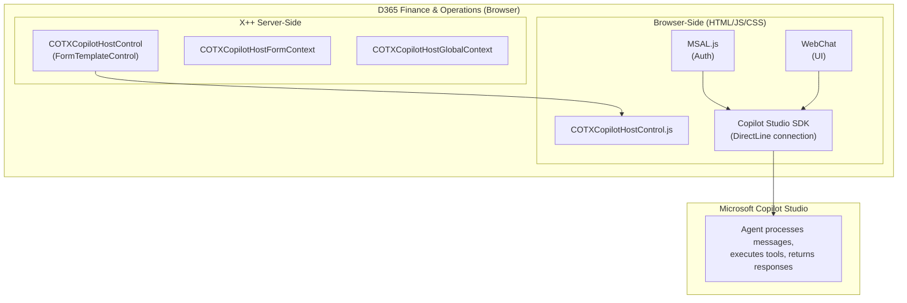
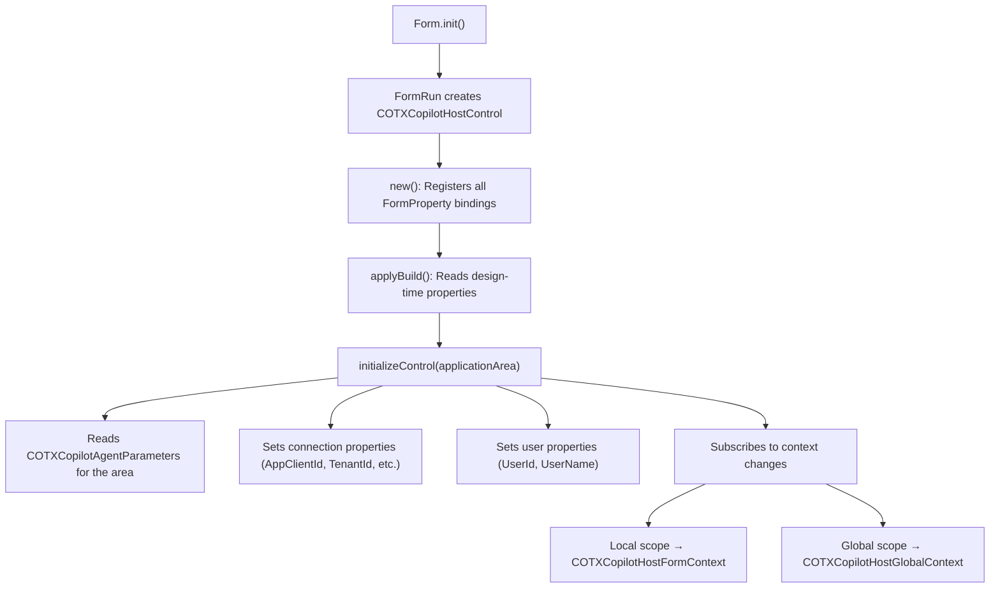
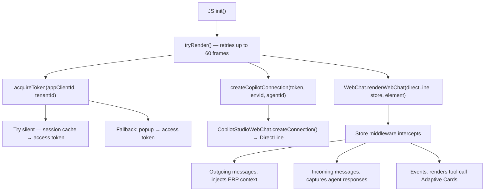
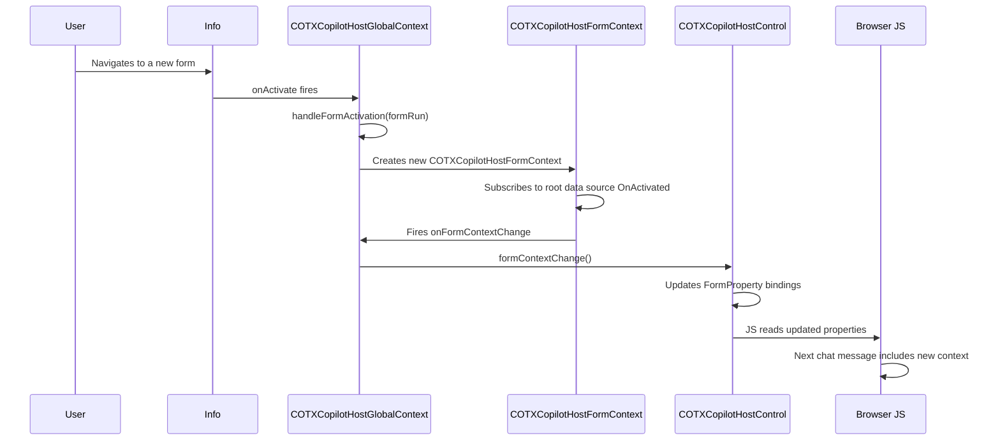
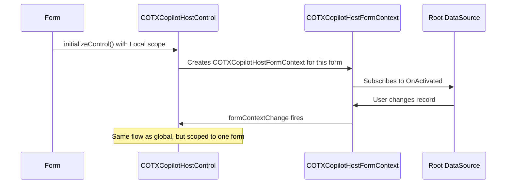
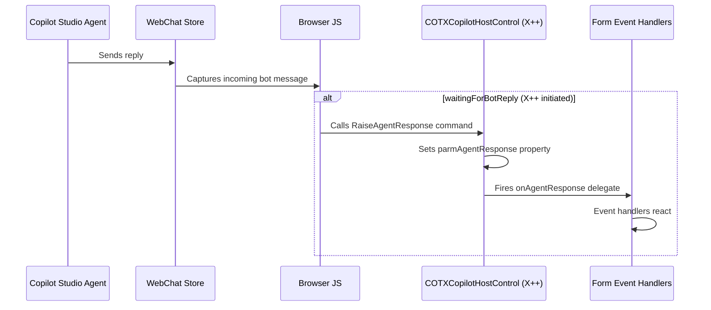

# Architecture

This document describes the technical architecture of the D365 Copilot Toolbox core solution for integrating Microsoft Copilot Studio agents into D365 Finance & Operations.

The Copilot Toolbox is designed to enable **multi-agent workflows** in D365 F&O. This architecture focuses on the foundational Copilot Studio integration, which provides the framework for embedding agents, routing to different agents based on application areas, and managing context flow between D365 and AI agents.

## High-Level Architecture



## Component Overview

### X++ Server-Side Components

| Class | Responsibility |
|-------|---------------|
| `COTXCopilotHostControl` | Main extensible form control. Reads agent configuration from the database, initializes form properties, and passes them to the browser-side JS. Handles incoming agent responses via `RaiseAgentResponse` command. |
| `COTXCopilotHostControlBuild` | Design-time companion class. Exposes `Application Area` and `Context Scope` properties in the Visual Studio form designer. |
| `COTXCopilotHostFormContext` | Tracks a single form's context: data area, form caption, menu item name, root data source table/record, and natural key/value. Fires `onFormContextChange` when the active record changes. |
| `COTXCopilotHostGlobalContext` | Singleton that subscribes to `Info.onActivate`; when the user navigates between root-navigable forms, it constructs a new `COTXCopilotHostFormContext` and propagates changes to the side panel control. |

### Browser-Side Components

| File | Responsibility |
|------|---------------|
| `COTXCopilotHostControl.html` | Loads MSAL.js 4.13.1, WebChat 4.18.0, and the main JS file. Contains the root `<div>` for the control. |
| `COTXCopilotHostControl.js` | Orchestrates the entire browser-side flow: MSAL token acquisition, Copilot Studio SDK connection, WebChat rendering, context injection middleware, tool call card rendering, and D365 extensible control registration. |
| `COTXCopilotHostControl.css` | Styles the chat interface (bubble appearance, tables, lists, scrollbars, headings) to match a modern Copilot aesthetic. |

### Data Model

| Table | Purpose |
|-------|---------|
| `COTXCopilotAgentParameters` | Stores per-agent configuration: Entra ID credentials, Dataverse connection details, context and display preferences. Cross-company (shared). |
| `COTXCopilotAgentApplicationAreas` | Maps `COTXCopilotAgentApplicationArea` enum values to `COTXCopilotAgentParameters` records. Enables multi-agent routing by application area. |

## Control Lifecycle

### 1. Form Initialization



### 2. Browser-Side Rendering



### 3. Context Flow

#### Global Context (Side Panel)



#### Local Context (Embedded Control)



### 4. Agent Response Handling



## Context Data Structure

The ERP context is injected into the `channelData.context` of every outgoing WebChat message:

```json
{
  "channelData": {
    "context": {
      "userLanguage": "en-us",
      "userTimeZone": "GMT Standard Time",
      "callingMethod": "",
      "legalEntity": "USMF",
      "currentUser": "Admin",
      "currentForm": "All Sales Orders",
      "currentMenuItem": "Sales order",
      "formMode": "",
      "currentRecord": {
        "tableName": "Sales order",
        "naturalKey": "Sales order",
        "naturalValue": "SO-000123"
      }
    }
  }
}
```

## Design Decisions

| Decision | Rationale |
|----------|-----------|
| **Browser-side MSAL** | No server-side secrets needed; leverages the user's existing Entra ID session. Popup fallback ensures first-time auth works. |
| **FormTemplateControl** | D365's extensible control pattern provides property binding, build-time designer support, and lifecycle hooks. |
| **Global singleton for context** | A single `COTXCopilotHostGlobalContext` instance subscribes once to `Info.onActivate`, avoiding redundant subscriptions. |
| **Application area routing** | Lookup table pattern allows multiple agents, with `Fallback` as a catch-all, extensible via enum extensions. |
| **Custom form pattern for side panel** | Aside pane forms require the `Custom` pattern and `setDisplayTarget(AsidePane)` before `super()` — this is per Microsoft guidance. |

## External Dependencies

| Library | Version | CDN | Purpose |
|---------|---------|-----|---------|
| MSAL.js | 4.13.1 | unpkg | Browser-side OAuth2 token acquisition |
| Bot Framework WebChat | 4.18.0 | unpkg | Chat UI rendering |
| Copilot Studio Client SDK | 1.2.3 | unpkg (ESM) | DirectLine connection to Copilot Studio agents |
