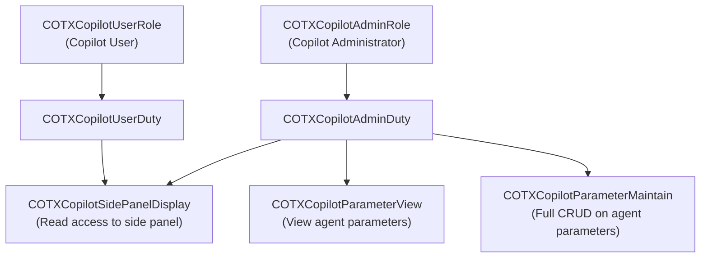
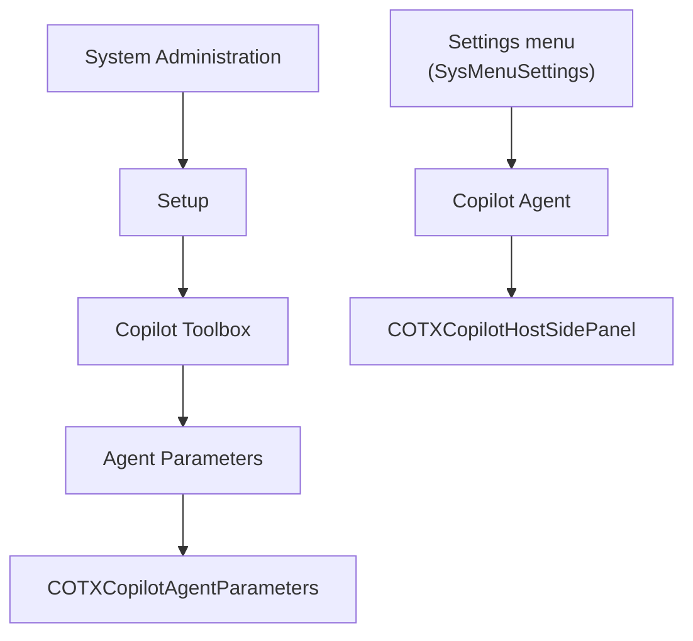

# Security Model

This document describes the security roles, duties, and privileges included in the D365 Copilot Toolbox.

## Overview

The Copilot Toolbox follows the standard D365 F&O role-based security pattern:

## Roles

| Role | Label | Purpose |
|------|-------|---------|
| `COTXCopilotAdminRole` | Copilot Administrator | Full access: configure agents, manage parameters, use side panel |
| `COTXCopilotUserRole` | Copilot User | Standard user: use the Copilot side panel |

## Duties

| Duty | Label | Included In |
|------|-------|-------------|
| `COTXCopilotAdminDuty` | Copilot Administrator | `COTXCopilotAdminRole` |
| `COTXCopilotUserDuty` | Copilot User | `COTXCopilotUserRole` |

## Privileges

| Privilege | Label | Access Level | Target |
|-----------|-------|-------------|--------|
| `COTXCopilotSidePanelDisplay` | Use Copilot side panel | Read | `COTXCopilotHostSidePanel` menu item |
| `COTXCopilotParameterView` | View Copilot parameters | Full CRUD | `COTXCopilotAgentParameters` menu item |
| `COTXCopilotParameterMaintain` | Maintain Copilot parameters | Full CRUD | `COTXCopilotAgentParameters` menu item |

## Menu Item Security

| Menu Item | Type | Form/Object | Required Privilege |
|-----------|------|-------------|-------------------|
| `COTXCopilotAgentParameters` | Display | `COTXCopilotAgentParameters` | `COTXCopilotParameterView` or `COTXCopilotParameterMaintain` |
| `COTXCopilotHostSidePanel` | Display | `COTXCopilotHostSidePanel` | `COTXCopilotSidePanelDisplay` |

## Menu Structure

## Entra ID Security

### App Registration Requirements

The SPA app registration used by the Copilot Toolbox:

- **Type:** Single Page Application (public client)
- **No client secret** required
- **Redirect URI:** Must point to the MSAL v5 redirect bridge: `https://<your-d365-environment>/resources/html/COTXMsalRedirectBridge.html`
- **API permission:** Power Platform API > Application > `CopilotStudio.Copilots.Invoke`

### Token Flow

1. User opens the Copilot control in D365
2. The MSAL v5 `PublicClientApplication` is created (or retrieved from a module-scoped cache keyed by `clientId|tenantId` — only the first call per pair creates a new instance)
3. MSAL.js checks for cached tokens in `sessionStorage`
4. If multiple accounts are cached (e.g. home-tenant + cross-tenant in a multi-tenant setup), `acquireToken` selects the account whose `tenantId` matches the agent’s configured tenant
5. If a matching account is found, acquires a token **silently** (no user interaction)
6. If not, shows a **popup** for interactive sign-in. The popup uses the MSAL v5 **redirect bridge** (`COTXMsalRedirectBridge.html`) for COOP-compatible authentication
7. The token is used to connect to Copilot Studio via the Agent SDK
8. Tokens are short-lived and scoped to the Power Platform API (`CopilotStudio.Copilots.Invoke`)

> **Note:** The MSAL instance cache persists for the lifetime of the browser page. When a user restarts a chat conversation or opens a new tab, the existing MSAL instance is reused — no re-initialisation or duplicate instances are created.

### MSAL v5 Redirect Bridge

MSAL v5 introduces stricter Cross-Origin-Opener-Policy (COOP) requirements. The D365 F&O host page may set COOP headers that prevent the popup window from communicating directly with the opener. To handle this:

- A **redirect bridge page** (`COTXMsalRedirectBridge.html` + `COTXMsalRedirectBridge.js`) is bundled as AxResource items
- The popup authentication flow redirects through this bridge page, which handles the token response in a separate window context and relays it back to MSAL
- No configuration is required — the bridge is used automatically when MSAL detects a COOP restriction

### Multi-Tenant Considerations

When an organisation uses agents in multiple Entra ID tenants (e.g. a home-tenant agent and a partner-tenant agent), the MSAL session-storage cache may contain accounts for more than one tenant. The control handles this by:

1. Filtering `PublicClientApplication.getAllAccounts()` by `account.tenantId`
2. Selecting only the account that matches the agent’s configured `TenantId`
3. Falling back to interactive (popup) auth if no matching account is found

This prevents the wrong identity from being used and ensures each agent gets a token for the correct tenant.

### Security Boundaries

| Boundary | Protection |
|----------|-----------|
| Token scope | Limited to Power Platform API — cannot access other APIs |
| Token lifetime | Short-lived; refreshed automatically by MSAL |
| Storage | Session storage only — cleared when the browser tab closes |
| Tenant isolation | Single-tenant app registration; tokens valid only for the configured tenant |
| Multi-tenant account selection | `acquireToken` filters cached accounts by `tenantId` to prevent cross-tenant identity leakage |
| User identity | The agent sees the actual D365 user identity via the application token |
| Supply-chain protection | Vendor libraries (MSAL, WebChat, SDK) are bundled locally as AxResources — not loaded from external CDNs at runtime. See `Scripts/Update-VendorLibs.ps1` for the download/verification process |
