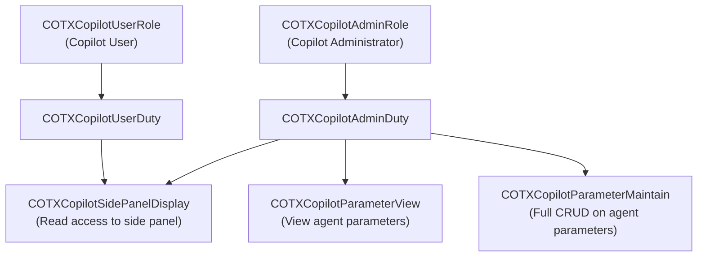
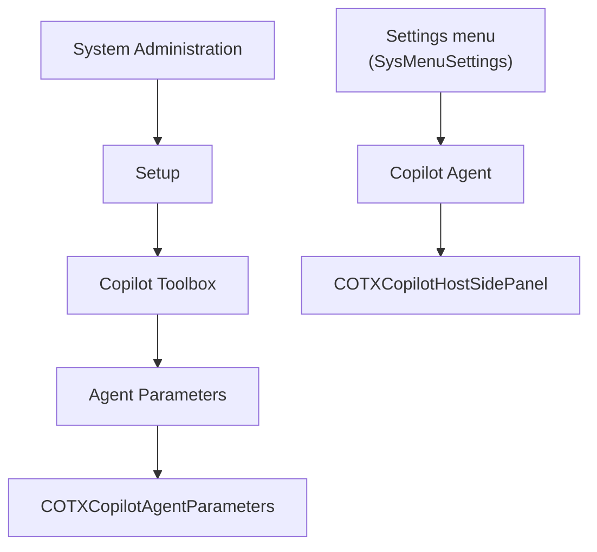

# Security Model

This document describes the security roles, duties, and privileges included in the D365 Copilot Toolbox.

## Overview

The Copilot Toolbox follows the standard D365 F&O role-based security pattern:

## Roles

| Role | Label | Purpose |
|------|-------|---------|
| `COTXCopilotAdminRole` | Copilot Administrator | Full access: configure agents, manage parameters, use side panel |
| `COTXCopilotUserRole` | Copilot User | Standard user: use the Copilot side panel |

## Duties

| Duty | Label | Included In |
|------|-------|-------------|
| `COTXCopilotAdminDuty` | Copilot Administrator | `COTXCopilotAdminRole` |
| `COTXCopilotUserDuty` | Copilot User | `COTXCopilotUserRole` |

## Privileges

| Privilege | Label | Access Level | Target |
|-----------|-------|-------------|--------|
| `COTXCopilotSidePanelDisplay` | Use Copilot side panel | Read | `COTXCopilotHostSidePanel` menu item |
| `COTXCopilotParameterView` | View Copilot parameters | Full CRUD | `COTXCopilotAgentParameters` menu item |
| `COTXCopilotParameterMaintain` | Maintain Copilot parameters | Full CRUD | `COTXCopilotAgentParameters` menu item |

## Menu Item Security

| Menu Item | Type | Form/Object | Required Privilege |
|-----------|------|-------------|-------------------|
| `COTXCopilotAgentParameters` | Display | `COTXCopilotAgentParameters` | `COTXCopilotParameterView` or `COTXCopilotParameterMaintain` |
| `COTXCopilotHostSidePanel` | Display | `COTXCopilotHostSidePanel` | `COTXCopilotSidePanelDisplay` |

## Menu Structure

## Entra ID Security

### App Registration Requirements

The SPA app registration used by the Copilot Toolbox:

- **Type:** Single Page Application (public client)
- **No client secret** required
- **Redirect URI:** Must match the D365 environment origin
- **API permission:** Power Platform API > Application > `CopilotStudio.Copilots.Invoke`

### Token Flow

1. User opens the Copilot control in D365
2. MSAL.js checks for cached tokens in `sessionStorage`
3. If available, acquires a token **silently** (no user interaction)
4. If not, shows a **popup** for interactive sign-in
5. The token is used to connect to Copilot Studio via the Agent SDK
6. Tokens are short-lived and scoped to the Power Platform API (`CopilotStudio.Copilots.Invoke`)

### Security Boundaries

| Boundary | Protection |
|----------|-----------|
| Token scope | Limited to Power Platform API — cannot access other APIs |
| Token lifetime | Short-lived; refreshed automatically by MSAL |
| Storage | Session storage only — cleared when the browser tab closes |
| Tenant isolation | Single-tenant app registration; tokens valid only for the configured tenant |
| User identity | The agent sees the actual D365 user identity via the application token |
